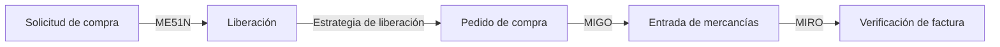
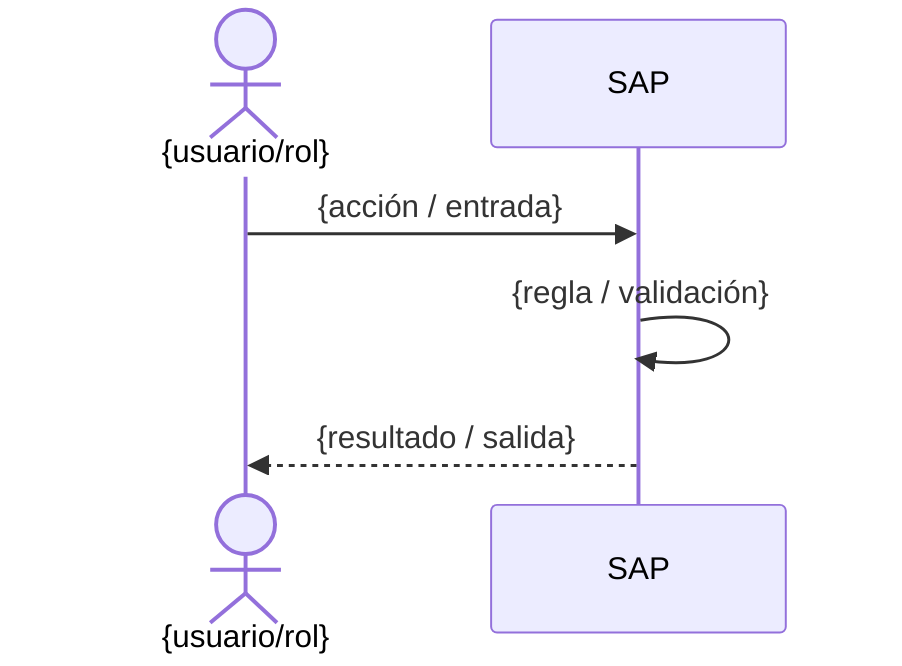

# Plantillas de entregables funcionales

El Advisor produce uno de estos según lo que se levantó. Mantén las plantillas cortas y
accionables. Son entregables **funcionales**: describen el QUÉ de negocio, no el CÓMO técnico.

## Pseudo-diagramas (cuándo y cómo)

Todo entregable es Markdown, así que un diagrama es solo un bloque **Mermaid** dentro del `.md`.
Propón uno cuando aclare más que la prosa; no llenes de diagramas lo que una lista resuelve.
Casos donde casi siempre vale la pena:

- **Flujo de proceso** (AS-IS o TO-BE) → `flowchart`. El TO-BE rotula cada paso con su
  transacción / app Fiori.
- **Integración cross-módulo** (un requerimiento que cruza FI/CO/MM/SD…) → `flowchart` con un
  subgraph por módulo, o `sequenceDiagram` si importa el orden temporal.
- **Comportamiento de un gap** (en la FS) → `sequenceDiagram` (actor → sistema → resultado) o
  `flowchart` con las ramas de decisión.

Reglas: rótulos en lenguaje de negocio (no nombres técnicos de tabla), un diagrama por idea, y
toda decisión que esté en el diagrama debe estar también en el texto (el diagrama acompaña, no
reemplaza). Ejemplo mínimo de flujo TO-BE:



## 1. BPD — Business Process Document

```
# BPD — {nombre del proceso}
Módulo: {FI|CO|MM|SD|PP|QM|PS|PM|HCM|EWM}  ·  Fase: Explore  ·  Fecha: {fecha}

## Disparador
{qué inicia el proceso y quién}

## Flujo AS-IS
1. {paso} — actor — dato que se mueve
2. ...

## Flujo TO-BE (en SAP estándar)
1. {paso} — transacción/app Fiori — config asociada
2. ...

## Diagrama del flujo TO-BE
```mermaid
flowchart LR
  A[{disparador}] -->|{trans/app}| B[{paso}]
  B -->|{trans/app}| C[{paso}]
```
{Incluye el diagrama solo si el flujo tiene 3+ pasos o ramas. Para procesos lineales cortos, la
lista basta.}

## Reglas de negocio
- {regla}

## Datos maestros involucrados
- {material / cliente / cuenta / centro de costo ...}
```

## 2. Matriz Fit-Gap

```
# Fit-Gap — {alcance}
Módulo(s): {...}  ·  Fecha: {fecha}

| # | Requerimiento | Veredicto | Cómo se cubre | Disposición |
|---|---------------|-----------|---------------|-------------|
| 1 | {req}         | Fit       | Config SPRO: {ruta} | Configurar |
| 2 | {req}         | Fit       | App Fiori: {nombre} | Adoptar |
| 3 | {req}         | Fit       | Best Practice: {proceso} | Adoptar |
| 4 | {req}         | Gap       | — | Requiere desarrollo |
| 5 | {req}         | Gap       | — | Descartar (alternativa estándar: {...}) |

Resumen: {N} Fit, {M} Gaps. Gaps que requieren desarrollo: {lista}.
```

## 3. FS — Especificación Funcional (para un gap)

```
# FS funcional — {nombre del gap}
Módulo(s): {...}  ·  Fecha: {fecha}

## Necesidad de negocio
{una frase: qué problema resuelve y para quién}

## Por qué es un gap (no estándar)
{qué config/app Fiori/Best Practice se evaluó y por qué no aplica}

## Comportamiento funcional esperado
{descripción funcional precisa: entradas, reglas, salidas, criterios de aceptación}

## Diagrama del comportamiento

{Usa `sequenceDiagram` cuando importe el orden actor→sistema→resultado, o `flowchart` si hay
ramas de decisión. Inclúyelo cuando el comportamiento no sea trivial.}

## Datos involucrados
- Maestros y transaccionales relevantes
- Origen y destino de la información (en términos de negocio)

## Impacto cross-módulo
{qué otros módulos se ven afectados; ver matriz de integración}

## Autorizaciones y supuestos
- {quién debe poder ejecutar/ver}
- Supuestos: {...}
```

Regla de oro: el FS funcional debe dejar el QUÉ tan claro que cualquier equipo técnico pueda
diseñar el CÓMO sin reinterpretar la necesidad de negocio. Marca lo no resuelto como
`[PENDIENTE]` para retomarlo.
